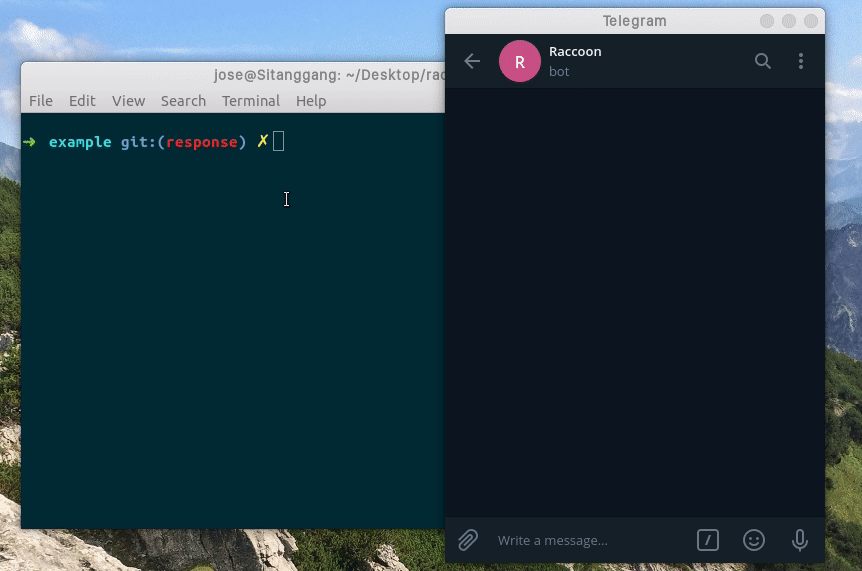

# Raccoonjs : Mini-framework for Telegram Bots
[](https://travis-ci.org/josestg/raccoonjs)

Making a telegram bot using Raccoonjs makes it easy for developers to focus on developing features. 

One of Raccoon's goals is to be able to automatically execute the methods in each feature just by entering the name of the method to be executed in the callback data.

## Why use Raccoonjs

1. Easy workflow (focus on developing feature).
2. Easily set how long a session for a feature over.
3. The response format is easy to read, etc.

## Quick Start

Create project

```bash
$ mdkir app
$ touch app/Task.js
$ touch main.js
```
Install racconjs

```bash
$ npm i raccoonjs@1.2.0
```

Create Feature

```js
// ./app/Task.js
const { Feature } = require('raccoonjs/Feature')
const { makeButton } = require('raccoonjs/helper')
const { ResponseMessage } = require('raccoonjs/ResponseMessage')
class Task extends Feature{
    constructor(onwer){
        super(owner)
    }

    start(){
        const keyboard = [[
            makeButton("Left", {
                prefix: this.prefix,
                action: "onLeftClicked",
                params: "1"
            }),
            makeButton("Right", {
                prefix: this.prefix,
                action: "onRightClicked",
                params: "2"
            })
        ]];
        
        return new ResponseMessage("$send", {
            owner: this.owner,
            message: "Hello, World!",
            inline_keyboard: keyboard
        })
    }

    onLeftClicked(params, context){
        console.log(params) // 1
        // edit current message
        const { reply_markup } = context.message
        return new ResponseMessage("$edit", {
            owner: this.owner,
            message: "Halo, Dunia!",
            inline_keyboard : reply_markup.inline_keyboard
        })
    }

    onRightClicked(params, context){
        console.log(params) // 2
        // delete current message and destroy feature session
        return new ResponseMessage("$delete", {
            owner: this.owner,
            destroy: true
        })
    }

}
```
Create main

```js
// main.js
const { Raccoon } = require('raccoonjs/Raccoon')
const { Task }  = require('./app/Task')
const R = new Raccoon(process.env.BOT_TOKEN, {polling: true})
R.onText(/\/t/, context => {
    const { from } = context
    const task = new Task(from.id)
    const token  = R.registerFeature(from.id, task)
    R.start(token, task)
    R.deleteMessage(from.id, context.message_id)
})
R.watchFeatureCallback()
```
Result



[See more example](https://github.com/josestg/raccoonjs-example)

## Similar Projects
1. [raccoonjs-example](https://github.com/josestg/raccoonjs-example)
2. [privy-standup-meeting-bot](https://github.com/mtfiqh/privy-standup-meeting-bot)


## Thank You
1. [Dimas](https://github.com/dimasadyaksa)
2. [M. Taufiq](https://github.com/mtfiqh)


